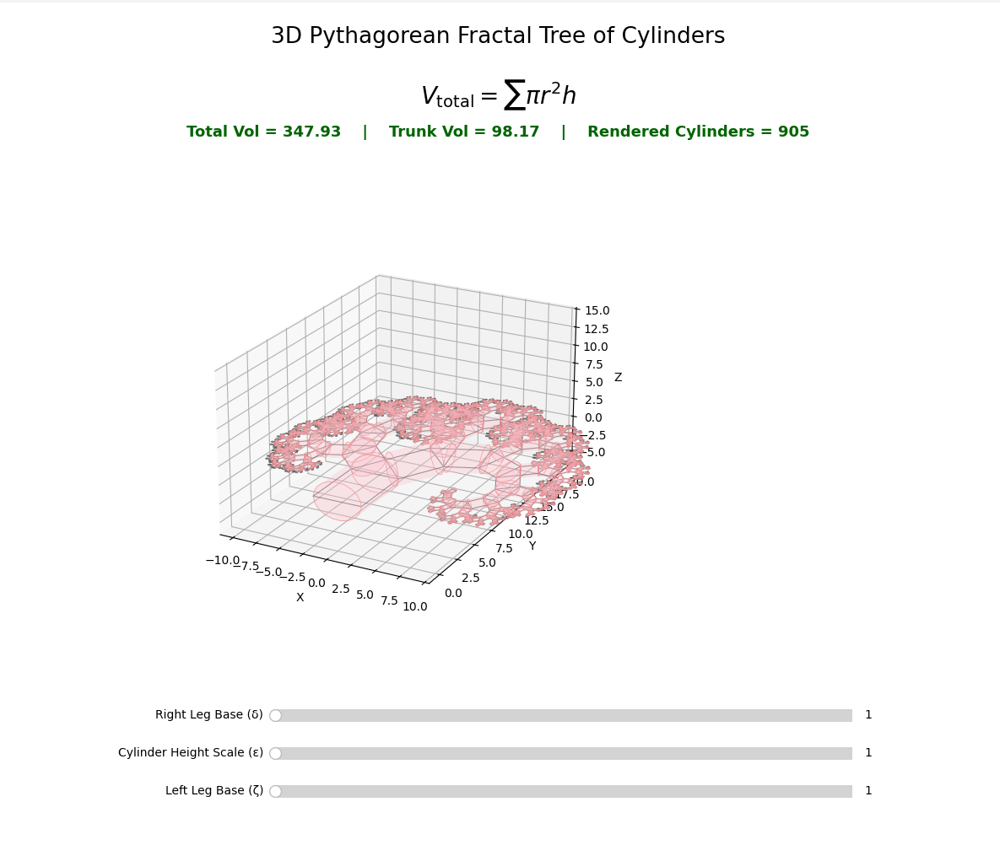

# 🌳 Pythagorean_Fractal – 3D Fractal Tree of Cylinders

[](https://www.python.org/)
[](https://matplotlib.org/)
[](https://numpy.org/)
[](https://www.microsoft.com/windows)

A fast, local, interactive desktop visualization of a 3D Pythagorean fractal tree built from cylinders.

Built with **Python**, **NumPy**, and **Matplotlib** for responsive geometric rendering, live slider controls, and real-time volume calculations.



------------------------------------------------------------------------

## 🤖 AI Agent & Developer Summary

- **Frontend / UI:** Matplotlib desktop window with interactive sliders
- **Backend / Math Engine:** NumPy-based geometric computation
- **Core Visualization:** 3D Pythagorean fractal tree rendered as cylinders
- **Key UX Features:**
  - Real-time slider-driven updates
  - Cached fractal generation for better responsiveness
  - Live total volume and trunk volume calculation
  - Adjustable right-leg, left-leg, and cylinder-height scaling
  - 3D camera controls through native matplotlib navigation
- **Rendering Model:**
  - Fractal squares computed recursively
  - Cylinder surfaces generated from square-centered geometry
  - Batched 3D collections for improved performance
- **Environment:** Local Python execution
- **Target Platform:** Windows desktop

------------------------------------------------------------------------

## 🚀 Why Pythagorean_Fractal?

Pythagorean_Fractal delivers:

- A visually rich 3D mathematical demonstration
- Interactive control over the fractal proportions
- Immediate visual response to parameter changes
- Live geometric volume calculations
- A compact local Python project with no web stack required

It is a clean experimental visualization focused on mathematical structure, geometric repetition, and responsive desktop rendering.

------------------------------------------------------------------------

## 🛠️ Installation (Windows)

### 1. Prerequisites

- Python 3 installed and available in PATH
- Recommended: latest stable Python from python.org

### 2. One-Time Setup

```cmd
cd E:\Pythagorean_Fractal
python -m venv venv
venv\Scripts\activate
python -m pip install --upgrade pip
pip install numpy matplotlib
```

### 3. Execution

```cmd
cd E:\Pythagorean_Fractal
venv\Scripts\activate
python app.py
```
### 4. 🎯 Features

Pythagorean_Fractal includes:
3D Pythagorean fractal tree rendering
Cylinder-based geometric abstraction
Slider controls for:
Right Leg Base (δ)
Height Scale (ε)
Left Leg Base (ζ)
Live statistics for:
Total volume
Trunk volume
Rendered cylinder count
Interactive 3D view with pan, zoom, and rotate support

### 5. 📊 Technical Specifications

| Feature | Specification |
|----------|--------------|
|Language | Python|
|Visualization | Matplotlib 3D|
|Math Engine | NumPy|
|Interaction	Matplotlib | Slider widgets|
|Geometry Model | Recursive Pythagoras tree|
|3D Primitive | Cylinders|
|Volume Calculation | Real-time|
|Caching | In-memory fractal cache|
|Runtime Style | Local desktop app|

### 6. 📁 Project Structure

```
Pythagorean_Fractal/
├── app.py           # Main application
├── run.bat          # One-click launcher
├── screenshot.png   # Application screenshot
├── Fractal.png      # Project image asset
├── Fractal.ico      # Project icon
├── README.md
└── LICENSE
```

